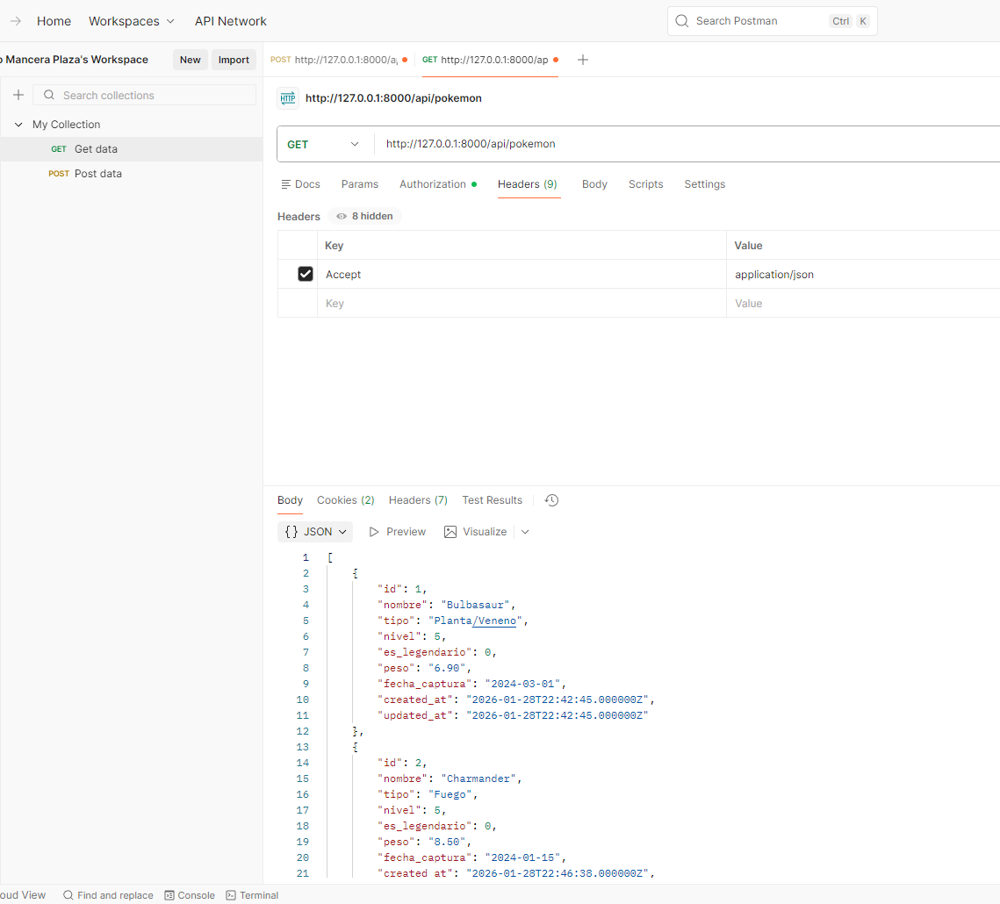
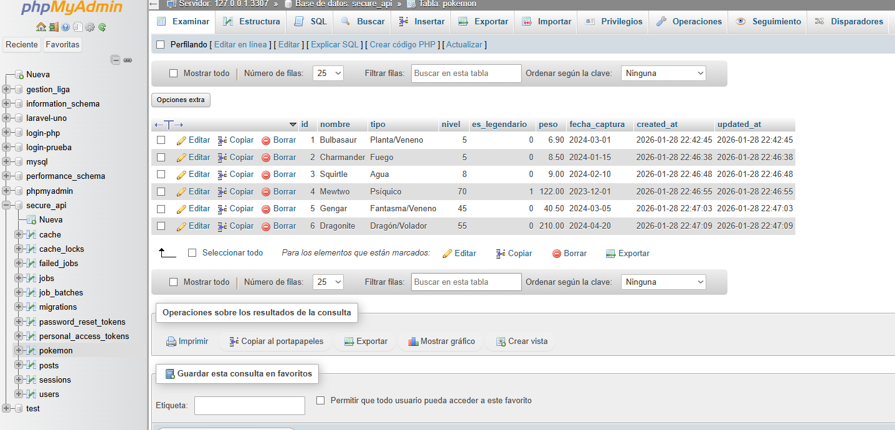
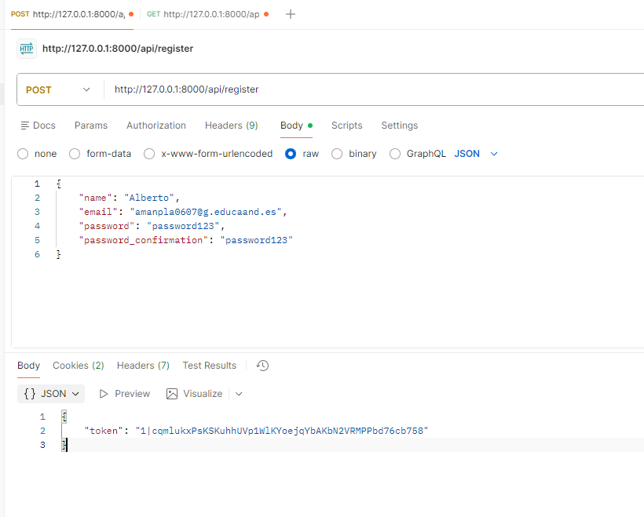

# 🚀 Práctica 5: API RESTful con Laravel 12 y Sanctum

Este proyecto consiste en el desarrollo de una API RESTful completa utilizando **Laravel 12**. Implementa autenticación segura mediante **Laravel Sanctum** y gestiona un modelo personalizado (`Pokemon`) con operaciones CRUD completas.

## 📋 Descripción del Proyecto (Ejercicio 2)

El objetivo principal es demostrar la capacidad de crear una API segura que gestione recursos complejos.

- **Modelo Personalizado:** `Pokemon`
- **Campos (6 columnas con 3 tipos de datos diferentes):**
    - `nombre` (String)
    - `tipo` (String)
    - `nivel` (Integer)
    - `es_legendario` (Boolean)
    - `peso` (Decimal/Double)
    - `fecha_captura` (Date)
- **Seguridad:** Todas las rutas de gestión de Pokémons están protegidas. Solo usuarios registrados y con un **Token Bearer** válido pueden acceder.

---

## ⚙️ Instalación y Configuración

Sigue estos pasos para desplegar el proyecto en local:

1.  **Clonar el repositorio / Descomprimir:**
    Ubícate en la carpeta del proyecto.

2.  **Instalar dependencias:**

    ```bash
    composer install
    ```

3.  **Configurar entorno:**
    - Renombrar el archivo `.env.example` a `.env`.
    - Configurar la base de datos en el archivo `.env`:
        ```env
        DB_CONNECTION=mysql
        DB_HOST=127.0.0.1
        DB_PORT=3306
        DB_DATABASE=secure_api
        DB_USERNAME=root
        DB_PASSWORD=
        ```

4.  **Generar clave de aplicación:**

    ```bash
    php artisan key:generate
    ```

5.  **Ejecutar migraciones (Base de datos):**
    Esto creará las tablas `users`, `personal_access_tokens` y `pokemon`.

    ```bash
    php artisan migrate
    ```

6.  **Iniciar el servidor:**
    ```bash
    php artisan serve
    ```

---

## 🛠️ Guía de Pruebas con Postman

Para probar la API correctamente, asegúrate de configurar el siguiente **Header** en todas tus peticiones en Postman:

- **Key:** `Accept`
- **Value:** `application/json`

### 1. Autenticación (Obtener Token)

Antes de gestionar Pokémons, necesitas registrarte o loguearte.

- **POST** `/api/register`
    - **Body (JSON):**
        ```json
        {
            "name": "Alberto",
            "email": "amanpla0607@g.educaand.es",
            "password": "password123",
            "password_confirmation": "password123"
        }
        ```
    - **Respuesta:** Copia el `token` que devuelve.

### 2. Gestión de Pokémons (Rutas Protegidas)

Para usar estas rutas, ve a la pestaña **Auth** de Postman, selecciona **Bearer Token** y pega el token obtenido en el paso anterior.

- **POST** `/api/pokemon` (Crear nuevo)
    - **Body (JSON):**
        ```json
        {
            "nombre": "Pikachu",
            "tipo": "Eléctrico",
            "nivel": 25,
            "es_legendario": false,
            "peso": 6.5,
            "fecha_captura": "2024-02-20"
        }
        ```

- **GET** `/api/pokemon` (Ver todos)
    - Devuelve la lista de todos los Pokémons creados.

- **GET** `/api/pokemon/{id}` (Ver uno específico)
    - Ejemplo: `/api/pokemon/1`

- **PUT** `/api/pokemon/{id}` (Actualizar)
    - Envía un JSON con los campos que quieras cambiar.

- **DELETE** `/api/pokemon/{id}` (Borrar)

---

## 📸 Capturas de Pantalla

### Creación exitosa de un pokemon



### Vista de la Base de Datos



### Uso del Token (Sanctum)



### POST /api/login


---
